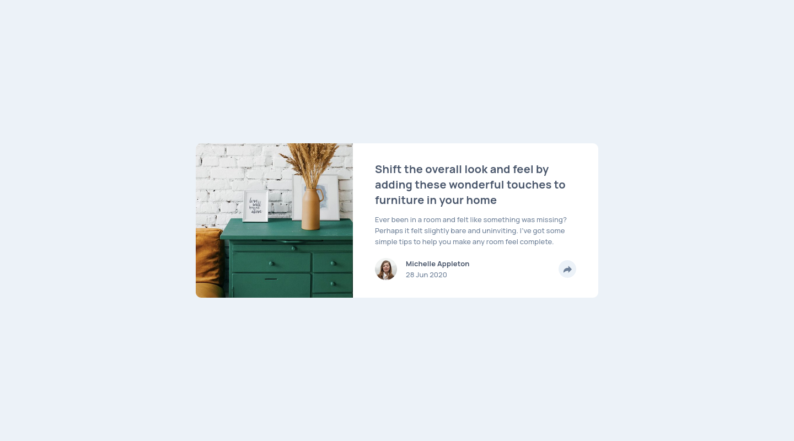

# Frontend Mentor - Article preview component solution

This is a solution to the [Article preview component challenge on Frontend Mentor](https://www.frontendmentor.io/challenges/article-preview-component-dYBN_pYFT). Frontend Mentor challenges help you improve your coding skills by building realistic projects. 

## Table of contents

- [Overview](#overview)
  - [The challenge](#the-challenge)
  - [Screenshot](#screenshot)
  - [Links](#links)
- [My process](#my-process)
  - [Built with](#built-with)
- [Author](#author)

## Overview

### The challenge

Users should be able to:

- View the optimal layout for the component depending on their device's screen size
- See the social media share links when they click the share icon

### Screenshot

#### Desktop

### Desktop - active state

### Links

- Solution URL: [https://github.com/teempe/frontend-mentor-article-preview-component.git](https://github.com/teempe/frontend-mentor-article-preview-component.git)
- Live Site URL: [https://teempe.github.io/frontend-mentor-article-preview-component/](https://teempe.github.io/frontend-mentor-article-preview-component/)

## My process

### Built with

- Semantic HTML5 markup
- CSS custom properties
- Flexbox
- CSS Grid
- Mobile-first workflow
- JavaScript
- [Sass](https://sass-lang.com/)

## Author

- Website - [teempe](https://github.com/teempe)
- Frontend Mentor - [@teempe](https://www.frontendmentor.io/profile/teempe)
